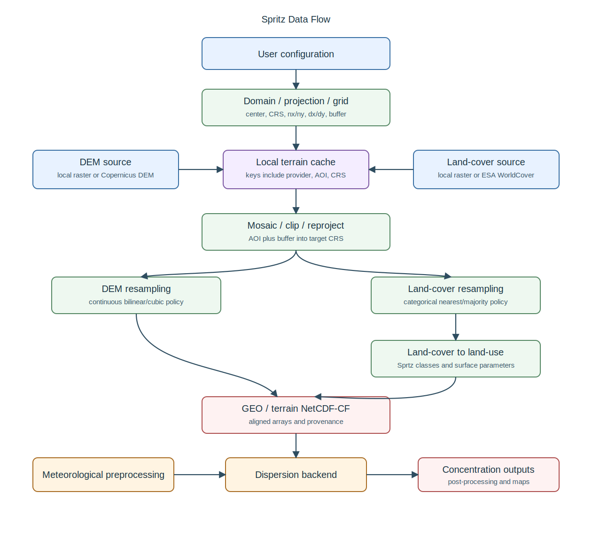

<p align="center">
  
</p>

# Spritz

Spritz is a GitHub-ready, clean-room, pure Python 3 project for atmospheric puff
and dispersion modeling workflows.

It provides shared configuration, legacy-control parsing, NetCDF-CF interoperability, command-line tools, examples, tests, unified Gaussian and particle dispersion backend selection, SpritzPost-style postprocessing, and publishing-quality visualization.

> Status: beta production software infrastructure. This repository does **not** contain, translate, embed, or redistribute proprietary Fortran sources, executables, manuals, sample data, or parameter tables from third-party modeling suites.

## Components

| Command | Module | Role |
| --- | --- | --- |
| `spritzwrf` | `sprtz.models.spritzwrf` | Legacy-compatible WRF/NetCDF metadata adapter. |
| SpritzWRF API | `sprtz.models.spritzwrf` | Clean-room WRF extraction for wind, precipitation, 2 m temperature, humidity, and downloader. |
| SpritzMet API | `sprtz.models.spritzmet` | Clean-room diagnostic meteorology, terrain-aware WRF downscaling, and MPI row decomposition. |
| `terrain` | `sprtz.models.terrain` | Clean-room terrain resampling and preprocessing. |
| `ctgproc` | `sprtz.models.ctgproc` | Land-use category aggregation. |
| `makegeo` | `sprtz.models.makegeo` | Terrain/land-use GEO table builder. |
| `spritzmet` | `sprtz.models.spritzmet` | Diagnostic gridded meteorology builder. |
| `spritz` | `sprtz.models.spritz` / `sprtz.models.particles` | Unified concentration command; JSON `run.backend` or `--backend` selects Gaussian or particles. |
| `sprtz-particles` | `sprtz.models.particles` | Backward-compatible alias that forces the particle backend. |
| `spritzpost` | `sprtz.models.spritzpost` | Receptor statistics and threshold summaries. |
| `sprtz-plot` | `sprtz.models.visualization` | Publishing-quality figures. |
| `sprtzfire` | `sprtz.models.firefront` | Clean-room stochastic wildfire spread, optional spotting/FIRMS/buoyancy/GPU/MPI. |
| `sprtz run` | `sprtz.workflow` | End-to-end orchestration. |

## SpritzFire Quick Start

```bash
sprtzfire --config examples/wildfire_minimal.json --output-dir output_fire --interchange json
sprtz run examples/wildfire_minimal.json --backend firefront --output-dir output_fire --interchange json
```

MPI plus optional CUDA examples:

```bash
mpiexec -n 4 spritzmet --config examples/minimal.json --output output_mpi/meteo.nc --parallel mpi --gpu-backend auto
mpiexec -n 4 spritz --config examples/minimal.json --meteo output_mpi/meteo.nc --output output_mpi/concentration.nc --parallel mpi --gpu-backend auto
mpiexec -n 4 sprtz run examples/wildfire_minimal.json --backend firefront --output-dir output_fire_mpi --parallel mpi --gpu-backend auto
```

See `docs/firefront.md`, `docs/firefront_numerical.md`, `docs/firefront_spotting.md`, `docs/firms_ignition.md`, `docs/firefront_gpu.md`, and `docs/spritzmet_mpi.md`.

## Documentation Index

| Document | Content |
| --- | --- |
| `docs/getting_started.md` | First run, installation assumptions, and basic commands. |
| `docs/user_manual.md` | Full CLI/configuration reference for routine use. |
| `docs/architecture.md` | Component architecture and responsibilities. |
| `docs/dataflow.md` | File and product flow between WRF, SpritzMet, Terrain, dispersion, and post-processing. |
| `docs/spritzwrf_spritzmet.md` | WRF ingestion and wind-field improvement/downscaling path. |
| `docs/terrain.md` | Terrain, DEM, land-cover, GEO generation, and provenance. |
| `docs/io_compatibility.md` | JSON, legacy text, CSV, and NetCDF-CF interoperability. |
| `docs/numerical_model.md` | Gaussian/particle dispersion assumptions and equations. |
| `docs/particle_model.md` | Particle backend details. |
| `docs/firefront.md` | SpritzFire user-facing module reference. |
| `docs/firefront_numerical.md` | SpritzFire numerical method details. |
| `docs/firefront_netcdf.md` | Firefront NetCDF-CF output conventions. |
| `docs/firefront_mpi.md` | SpritzFire MPI realization splitting. |
| `docs/firefront_gpu.md` | Optional CUDA/CuPy acceleration for SpritzFire. |
| `docs/firefront_spotting.md` | RandomFront spotting. |
| `docs/firms_ignition.md` | FIRMS/VIIRS satellite ignition ingestion. |
| `docs/buoyancy_correction.md` | Semi-coupled fire buoyancy wind correction. |
| `docs/backward.md` | Backward plume source and fire/arson origin attribution. |
| `docs/parallelization.md` | MPI/GPU execution models across SpritzMet, Gaussian, particles, and SpritzFire. |
| `docs/spritzmet_mpi.md` | SpritzMet spatial MPI decomposition. |
| `docs/hpc.md` | SLURM batch scripts for HPC systems. |
| `docs/visualization.md` | Plotting and map outputs. |
| `docs/validation.md` | Validation expectations and limitations. |
| `docs/production_readiness.md` | Operational readiness checks. |
| `docs/migration_notes.md` | Migration notes for compatible workflows. |
| `docs/usecases.md` | Index of runnable use-case templates. |

## Recommended Reading Paths

Run the examples:

1. `docs/getting_started.md`
2. `examples/README.md`
3. `docs/usecases.md`
4. `docs/io_compatibility.md`

Set up a production wind-field improvement from WRF:

1. `docs/spritzwrf_spritzmet.md`
2. `docs/terrain.md`
3. `docs/dataflow.md`
4. `docs/production_readiness.md`
5. `docs/hpc.md`

WRF-to-SpritzMet downscaling now preserves diagnostic `U10M`/`V10M`, writes
2 m temperature in Celsius as `temperature_2m_c(time,y,x)`, writes
2 m relative humidity as the unitless rate `relative_humidity_2m(time,y,x)`,
uses DEM and land-cover inputs for deterministic terrain-aware refinement, and
can partition the local grid by MPI rows with `parallel="auto"` or
`--parallel auto`.

Simulate a plume for wildfire, arson, or industrial smoke:

1. `docs/numerical_model.md`
2. `docs/particle_model.md`
3. `docs/io_compatibility.md`
4. `docs/parallelization.md`
5. `docs/visualization.md`

Simulate fire-front evolution and related smoke plume:

1. `docs/firefront.md`
2. `docs/firefront_numerical.md`
3. `docs/firefront_spotting.md`
4. `docs/buoyancy_correction.md`
5. `docs/firefront_mpi.md`
6. `docs/firefront_gpu.md`

Estimate the possible origin of an odor, stink, plume, wildfire, or arson event:

1. `docs/backward.md`
2. `examples/backward_plume.json`
3. `examples/backward_firefront.json`
4. `docs/hpc.md` for larger candidate grids
5. `docs/validation.md` before operational interpretation

## Installation

```bash
python -m venv .venv
. .venv/bin/activate
python -m pip install -U pip
python -m pip install -r requirements.txt
python -m pip install -e .[netcdf,viz]
# optional MPI/HPC support
python -m pip install -e .[netcdf,viz,mpi]
# optional geospatial Terrain acquisition support
python -m pip install -e .[geo,netcdf]
```

For development:

```bash
python -m pip install -e .[dev,netcdf,viz]
python -m pytest -q
python -m compileall src tests
python scripts/check_release.py
```

## Quick start

For a complete step-by-step path from WRF download to Spritz visualization, see `docs/getting_started.md`. For full configuration, CLI, output, Terrain, MPI, and validation details, see `docs/user_manual.md`.

Preferred NetCDF-CF workflow:

```bash
sprtz run examples/minimal.json --output-dir output --interchange netcdf
sprtz run examples/minimal.json --output-dir output-10min --interchange netcdf --output-interval 600
sprtz run examples/minimal.json --output-dir output-particles --backend particles --interchange netcdf
mpiexec -n 4 sprtz run examples/minimal.json --output-dir output-mpi --interchange netcdf --parallel auto
sprtz-plot --input output/concentration.nc --output output/concentration.png
sprtz doctor
```

JSON can select the dispersion behavior directly:

```json
{
  "run": {
    "backend": "gaussian",
    "concentration_output": "grid",
    "field_z_levels": {
      "preset": "exponential",
      "count": 21,
      "base_m": 10.0
    }
  }
}
```

This preset samples heights above ground as `10 * exp(level_index)` for
`level_index` values `0..20`. A literal list such as `[0.0, 25.0, 50.0]`
remains supported when exact heights are required.

With NetCDF-CF output, gridded runs include receptor-table variables plus
`concentration_field(time, field_z, field_y, field_x)`. When configuration
metadata provides `center_lat` and `center_lon`, gridded field receptors also
carry WGS84 latitude/longitude coordinates; the model-grid midpoint remains
`x=0, y=0` for odd node-count centered grids.
For external comparison workflows, Gaussian and particle gridded concentration
outputs can also be exported with `--format calpuff` on `spritz`, or as
`concentration_calpuff.dat` sidecars from use case 02 with `--calpuff-binary`.
These are clean-room CALPUFF-style binary exports generated from Sprtz
NetCDF/row data; NetCDF-CF remains the canonical interchange.

Time-aware and washout options live in the same `run` block:

```json
{
  "run": {
    "weather_start_datetime": "2026-06-01T00:00:00+00:00",
    "weather_end_datetime": "2026-06-01T12:00:00+00:00",
    "event_start_datetime": "2026-06-01T00:00:00+00:00",
    "event_end_datetime": "2026-06-01T12:00:00+00:00",
    "firefighters_start_datetime": "2026-06-01T06:00:00+00:00",
    "firefighters_end_datetime": "2026-06-01T09:00:00+00:00",
    "firefighters_emission_factor": 0.5,
    "precipitation_washout": true
  }
}
```

Generate an offline high-resolution Terrain/GEO product:

```bash
sprtz-terrain fetch --config examples/highres_terrain_local.json --json
sprtz run examples/highres_terrain_local.json --output-dir output-terrain-local --interchange json
```

Legacy-compatible workflow:

```bash
spritzmet --config examples/minimal.inp --output output/meteo.json --format json
spritz --config examples/minimal.inp --meteo output/meteo.json --output output/concentration.csv --format csv
spritz --config examples/minimal.inp --meteo output/meteo.json --output output/particle_concentration.csv --format csv --backend particles
spritzpost --input output/concentration.csv --output output/post.json
```

`sprtz-particles` remains available for older scripts and is equivalent to
`spritz --backend particles`.

## Input/output policy

MPI parallel execution is available through the optional `mpi4py` extra for SpritzMet diagnostic grids, WRF-to-local-grid downscaling, and the Gaussian and particle backends. See `docs/parallelization.md` for the detailed schema and `docs/parallel_mpi.md` for command examples.

The suite accepts a shared JSON configuration model and tolerant Fortran-style `.inp` control files. New module interoperability prefers NetCDF-CF. CSV, clean-room CALPUFF-style concentration binary exports, and legacy text outputs are retained for migration and comparison workflows. See `docs/io_compatibility.md` and `docs/spritzwrf_spritzmet.md`.

## Architecture


The architecture layers are described in `docs/architecture.md`. The Spritz logo is an outlined vector mark showing the project wordmark, airflow path, and dispersion puffs.

## Data flow



The terrain, meteorology, dispersion, post-processing, and visualization data flow is described in `docs/dataflow.md`.

## Numerical scope

Version 0.4.x adds non-steady Gaussian puff calculations, finite source-size handling for point/area/volume/line-road/flare/spray-style sources, plume rise, stack-tip downwash, dry and wet deposition fluxes, precipitation-driven washout, decay/scavenging/settling losses, datetime event windows, firefighter action windows, material presets, multi-fire scenario generation, and SpritzPost-style averages, maxima, ranked values, and percentiles. See `docs/numerical_model.md`.

## Scientific boundary

This repository is production-ready as Python software infrastructure when the local diagnostic command reports success. Run `sprtz doctor` in the target environment, and use `sprtz doctor --require-netcdf --require-viz` when NetCDF-CF and publishing figures are mandatory. Regulatory or operational suitability must be established by independent validation for the intended use case. See `docs/validation.md`.

## Repository layout

```text
src/sprtz/       Python package
tests/               pytest suite
examples/            coherent JSON, legacy, raster examples
docs/                architecture, SpritzWRF/SpritzMet, I/O, validation, production, visualization notes
.github/workflows/   CI template
```

## License

MIT for the Python code in this repository. Spritz, SpritzWRF, SpritzMet,
Terrain, and SpritzPost name the clean-room components in this project.

## Operational use cases

Spritz includes a root-level `usecases/` folder with reproducible templates for:

- high-resolution wind and precipitation-rate downscaling from 1 km WRF to a 100 m local grid centered on a supplied latitude/longitude or conservatively covering a supplied bounding box;
- arson/wildfire screening simulations using the same Spritz configuration and output conventions as the main suite;
- model evaluation against satellite-derived masks with a lightweight deterministic AI calibration layer.
- catalog-driven production incident screening with receptor latitude/longitude and geographic maps.
- high-resolution Bay of Naples sailing wind forecasts with configurable outlook, bounding box, vertical levels, and temporal cadence.
- a 12-hour Acerra waste-to-energy chimney screening case starting on 2026-06-01.

Install the package, then run the explicit root-level didactic steps. The use cases are intentionally not importable suite modules:

```bash
python usecases/01_high_resolution_wind_field/step_01_downscale_wind.py --date 20260527Z0000 --hours 24 --download-dir data/wrf --output data/wrf_100m_wind.nc --center-lat 40.85 --center-lon 14.27 --nx 101 --ny 101 --dx 100 --dy 100 --config usecases/01_high_resolution_wind_field/config.json
python usecases/02_wildfire_arson_effects/step_02_build_config.py --output data/wildfire_case/wildfire_event.json --center-lat 40.85 --center-lon 14.27 --material plastic --start 20260527Z0000 --end 20260527Z0100 --precipitation-washout
python usecases/02_wildfire_arson_effects/step_03_run_model.py --config data/wildfire_case/wildfire_event.json --output-dir data/wildfire_case/model_compare --backend both --interchange netcdf --calpuff-binary
python usecases/03_satellite_ai_evaluation/step_02_evaluate.py --concentration data/wildfire_case/model_compare/particles/concentration.nc --satellite-mask data/satellite_mask.json --output data/wildfire_case/evaluation.json
python usecases/04_production_incidents/step_01_build_config.py --code 2021_44 --output data/production_2021_44/2021_44_config.json
python usecases/04_production_incidents/step_02_run_model.py --config data/production_2021_44/2021_44_config.json --output-dir data/production_2021_44/model --interchange netcdf
python usecases/05_sailing_wind_forecast/step_01_build_forecast.py --output data/sailing_bay_of_naples.json
python usecases/06_acerra_waste_to_energy/step_01_build_config.py --output data/acerra_wte/acerra_waste_to_energy.json
python usecases/06_acerra_waste_to_energy/step_02_run_model.py --config data/acerra_wte/acerra_waste_to_energy.json --output-dir data/acerra_wte/model --interchange netcdf
```

The use cases prefer NetCDF-CF products when `netCDF4` is installed and fall back to JSON/CSV for lightweight runs and automated tests. They are documented examples under `usecases/`, not part of the `sprtz` package namespace.
