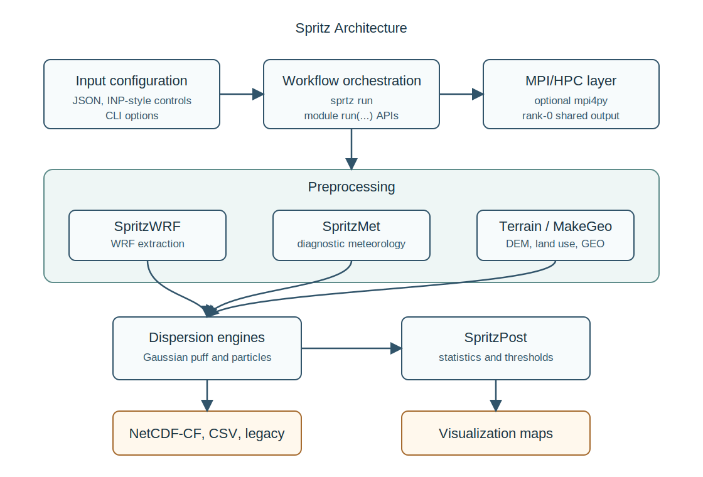

# Architecture

SpritzMet composes optional clean-room operators from
`sprtz.models.spritzmet_physics` while preserving the stable
`sprtz.models.spritzmet` module. See
[`spritzmet_physics.md`](spritzmet_physics.md).

## Scientific Scope

This document summarizes Sprtz as a clean-room scientific software architecture for atmospheric dispersion, meteorological preprocessing, terrain coupling, fire-front dynamics, and reproducible model evaluation. It is written as a technical design record rather than a regulatory validation claim.

Spritz is organized as a clean-room Python suite with one shared configuration
model and independent model components. Every production component exposes a
small Python API and a deterministic command-line surface.

## Input Configuration Layer

Spritz accepts JSON configuration, tolerant INP-style legacy control files, and
CLI options. JSON remains the richest format because it can carry domain,
terrain, meteorology, source, receptor, workflow, and provenance settings in one
portable document.

## Orchestration Layer

`sprtz run` coordinates the standard workflow:

1. optional Terrain acquisition and GEO generation;
2. SpritzMet meteorology;
3. unified Spritz Gaussian or particle dispersion;
4. SpritzPost statistics.

The same modules can be invoked directly through their console scripts or Python
`run(...)` functions for batch/HPC integration.

## Meteorological Preprocessing

SpritzWRF reads WRF-oriented NetCDF inputs and normalizes clean-room near-surface
wind and precipitation fields. SpritzMet creates diagnostic meteorology on the
model grid, supports WRF-to-local-grid downscaling in didactic use cases, and
writes NetCDF-CF or JSON outputs. The meteorology layer remains
optional-dependency friendly:
NetCDF support is used when installed, while JSON fallback keeps tests and
lightweight deployments deterministic.

## Terrain And Land-Use Preprocessing

Terrain now has two layers:

- `sprtz.models.terrain` keeps the existing local ASCII-grid resampling API
  and `terrain` CLI for backward compatibility.
- `sprtz.terrain` provides production-style acquisition concepts: local and
  online provider interfaces, deterministic cache metadata, AOI/domain handling,
  continuous DEM resampling, categorical land-cover resampling, land-cover to
  Spritz land-use remapping, surface-parameter derivation, and NetCDF-CF/JSON GEO
  output with provenance.

MakeGeo and CTGPROC remain lightweight clean-room helpers for GEO tables and
category aggregation.

## Dispersion Engines

The unified Spritz concentration layer selects the Gaussian or particle backend
from JSON `run.backend` or CLI `--backend`. The Gaussian backend supports puff
and plume modes, finite source dimensions, effective release height, dry/wet
deposition fluxes, first-order losses, precipitation washout, source/event time
windows, firefighter emission factors, deterministic receptor outputs, and
model-grid 3D concentration fields. The particle backend consumes the same
configuration and meteorology exchange products, honors the same time-window and
washout controls, writes the same output schema, and is deterministic for a
fixed seed.

## Post-Processing And Outputs

SpritzPost computes maxima, averages, ranked values, percentiles, and threshold
summaries from concentration/deposition outputs. Module exchange prefers
NetCDF-CF. Concentration NetCDF files keep the receptor table and, for complete
grid outputs, include `concentration_field(time, field_z, field_y, field_x)`.
When metadata provides a local-grid geographic center, generated grid-field
receptors carry latitude/longitude as well as local x/y so downstream
comparison and plotting workflows can audit the center cell.
CSV, JSON, and legacy-style outputs remain available for portability and
migration workflows.

## Visualization

`sprtz-plot` renders local or geographic concentration maps from CSV, JSON, or
NetCDF-CF outputs. It supports receptor latitude/longitude, local-grid to WGS84
transforms, high-DPI output, offline raster basemaps, and explicit opt-in web
tile basemaps.

## HPC And MPI Compatibility

`sprtz.parallel.mpi` keeps MPI optional. Serial runs use the same API as MPI
runs. MPI-enabled workflows partition receptor computations, gather results, and
write shared outputs only on rank 0 to avoid multi-writer NetCDF corruption.

## Clean-Room Rule

The repository implements behavior from first principles and public component
roles. It does not translate proprietary routines, redistribute proprietary data,
or claim regulatory equivalence without independent validation.

## References

- Wilson, G., Aruliah, D. A., Brown, C. T., Hong, N. P. C., Davis, M., Guy, R. T., Haddock, S. H. D., Huff, K. D., Mitchell, I. M., Plumbley, M. D., Waugh, B., White, E. P., and Wilson, P. (2014). Best practices for scientific computing. PLOS Biology, 12(1), e1001745. https://doi.org/10.1371/journal.pbio.1001745
- Sandve, G. K., Nekrutenko, A., Taylor, J., and Hovig, E. (2013). Ten simple rules for reproducible computational research. PLOS Computational Biology, 9(10), e1003285. https://doi.org/10.1371/journal.pcbi.1003285
- Hanna, S. R. (1989). Confidence limits for air quality model evaluations, as estimated by bootstrap and jackknife resampling methods. Journal of the Air and Waste Management Association, 39(9), 1170-1175.
- Chang, J. C., and Hanna, S. R. (2004). Air quality model performance evaluation. Meteorology and Atmospheric Physics, 87, 167-196.
